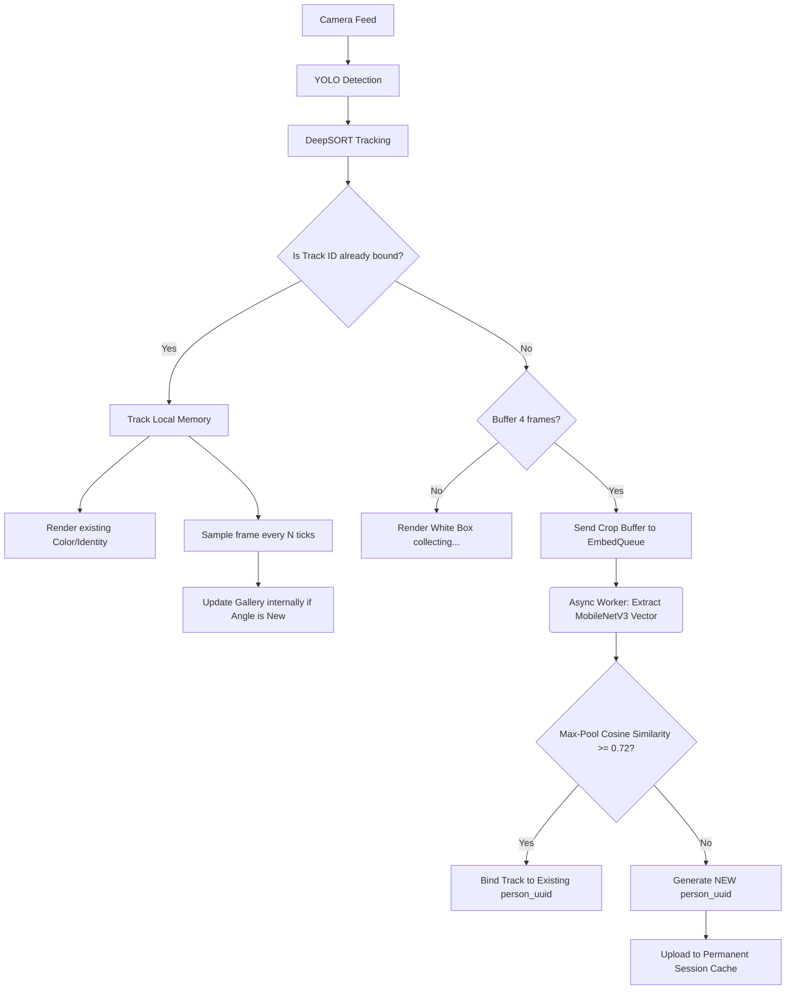

# SURVEILLANT System Architecture Report

The SURVEILLANT system is a multi-camera real-time person re-identification (Re-ID) and tracking network. This document formalizes the architecture, algorithms, and process flows driving the system, detailing its evolution into the stable, highly-concurrent architecture achieved in Phase 3.

---

## 1. Core Architecture Overview

The system is designed around a multi-threaded, asynchronous processing pipeline designed to separate high-frequency tasks (bounding box tracking) from low-frequency, CPU-intensive tasks (feature extraction and database reconciliation).

### 1.1 The Threading Model (Phase 2 & 3)

The system avoids CPU starvation by dividing labor into three dedicated thread domains:

1. **The Detection Loop (Main Thread & Round-Robin Worker)**
   - Responsible for rapidly cycling through camera frames at native FPS.
   - Utilizes a single initialized **YOLOv8** model running in a continuous cycle across all cameras, completely eliminating parallel-process CPU contention.
   - Pushes raw video frames through **DeepSORT (SORT mode)** to obtain rapid spatial bounding box estimates (bypassing slow CNN features).
2. **The Asynchronous Embedding Worker**
   - Maintains an `embed_queue` of `(cam_id, track_id, crop)` tuples sent by the detection loop for unknown persons.
   - Operates a **MobileNetV3** backbone to extract 576-dimensional semantic feature vectors. 
   - Manages SQLite writes to register tracked identities to persistent `person_uuid`s.
3. **The Background Reconciliation Worker**
   - A daemon thread waking every 120 seconds.
   - Pools massive amounts of SQLite Re-ID vectors.
   - Performs quadratic checks ($O(N^2)$) using `cosine_similarity` to automatically merge identities that share appearance features but were initially classified as separate (`person_id_a` -> `person_id_b`).

---

## 2. Subsystem Details & Algorithms

### 2.1 The Tracking Subsystem (DeepSORT)
The tracker binds bounding boxes frame-to-frame utilizing purely spatial estimations.
- **Algorithm**: Tracks are predicted across frames using a linear **Kalman Filter**. Bounding boxes are associated with state predictions using the Hungarian algorithm based on the **Mahalanobis** distance and **Intersection over Union (IoU)**.
- **Optimization**: The default DeepSORT Re-ID convolutional neural network (MobileNet) was intentionally short-circuited by issuing "dummy" 1D vector embeddings to dramatically increase bounding box precision and tracking speed, leaving Re-ID strictly to the global SURVEILLANT memory manager.

### 2.2 The Auto-Learning Global Gallery
SURVEILLANT abandons the "one embedding per person" fallacy commonly found in simple Re-ID systems.
- Every registered `person_id` maintains an internal `List[Embedding]` (up to 10 stored angles per person). 
- **The Heuristic Angle Storage Algorithm**: When a tracked individual yields a new frame crop, its embedding is extracted. If the geometric cosine distance to all existing stored embeddings for that person exceeds `BODY_GALLERY_ADD_DISTANCE (0.35)`, it is deemed to be a "new angle" (e.g. a side profile or back profile) and is added to the database.
- **Cross-Camera Feedback**: DeepSORT's local appearance model gets routinely injected with the global gallery array via `reinforce_track()`.

### 2.3 The Storage Engine
- **SQLite with WAL**: System employs SQLite utilizing Write-Ahead Logging (`PRAGMA journal_mode=WAL`). This natively permits simultaneous locking (unlimited readers alongside a writer) which guarantees the real-time detection thread never throws blocking deadlocks while the background worker modifies identity clusters.
- **Schema**:
  - `persons`: Primary human index. Maintains `status` fields (`unverified`, `confirmed`, `multi_view`).
  - `person_embeddings`: BLOB storage for NumPy `.tobytes()` vectors.
  - `camera_history`: Time-series log.
  - `merge_proposals`: Re-ID algorithm discrepancy table.

---

## 3. Process Flow (Detection to Identity)

The system processes incoming data through strict logical gates designed to prevent identity pollution.

---

## 4. Phase 3 Overview: The Identity Search Engine

Phase 3 introduces retroactive query capabilities into the live Re-ID structure.
- **Command Line CLI**: Operator inputs a random suspect image via file path.
- **Embed Extractor**: The query image is immediately converted to a `.shape = (1, 576)` embedding utilizing the global MobileNetV3 environment.
- **Max-Pool Searching Engine**: The system pulls the full database (`get_all_galleries_typed()`) and calculates cosine similarities matrix comparing the single query image against every combination of stored multi-angle vectors.
- **Sort & Display**: Returns exact matched `person_id` strings, confidence scores, and origin cameras formatting output into the operator console.

---

## 5. Next Steps
With structural tracking latency problems resolved, robust multi-threading established, and database lock failures eradicated via WAL, the system is fully prepared to enter **Phase 4**: LLM deployment using multimodal agents (Qwen2.5-VL) to passively monitor bounding box crops for actionable intelligence.
