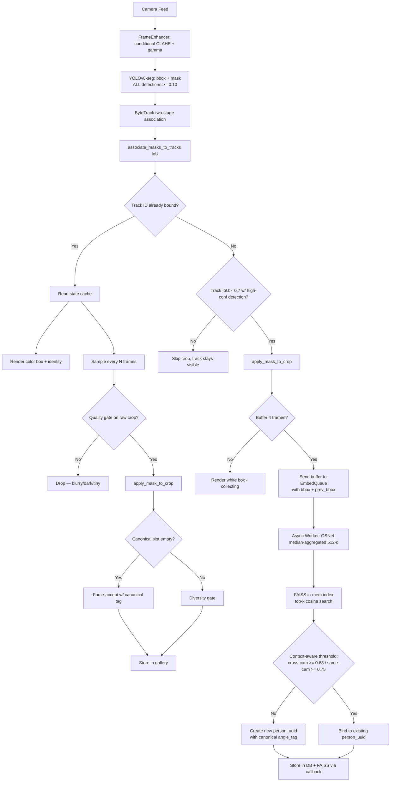

# SURVEILLANT System Architecture Report

The SURVEILLANT system is a multi-camera real-time person re-identification (Re-ID) and tracking network. This document tracks the full evolution of the architecture through all completed phases.

---

## 1. Core Architecture Overview

The system is designed around a multi-threaded, asynchronous processing pipeline that separates high-frequency tasks (bounding box tracking) from low-frequency, CPU-intensive tasks (feature extraction and database reconciliation).

### 1.1 The Threading Model

Three dedicated thread domains eliminate CPU starvation:

1. **Detection Loop (Round-Robin Worker)**
   - Cycles through all cameras one at a time — one YOLO inference per cycle — eliminating parallel-process CPU contention.
   - Every frame is conditionally passed through `FrameEnhancer` (CLAHE + auto-gamma); both stages are skipped for bright frames to save CPU.
   - Uses `yolov8n-seg.pt` which produces per-person pixel masks alongside bounding boxes.
   - Feeds detections — including **low-confidence** ones (≥ 0.10) — to **ByteTrack** for two-stage association.
   - Per-track binary masks are recovered post-tracking by IoU-matching tracks to their originating detections.

2. **Asynchronous Embedding Worker**
   - Consumes an `embed_queue` of `(cam_id, track_id, crop, bbox, prev_bbox, ...)` items.
   - Crops are already mask-cleaned (background → neutral gray) and pre-gated for quality.
   - **Only high-confidence crops (≥ `BYTETRACK_TRACK_THRESH = 0.45`)** are added to the identification buffer. The high-conf detection that matches the track is found by IoU (≥ 0.7), not bbox equality, because ByteTrack returns Kalman-corrected boxes.
   - Uses **OSNet x1.0 (torchreid)** with **Market-1501 Re-ID weights** to extract 512-d feature vectors.
   - Each new person's initial embedding is tagged with a canonical view (`frontal`/`side`/`right_moving`/`left_moving`) so reconciliation's view-coverage scoring works from day 1.

3. **Background Reconciliation Worker**
   - Daemon thread waking every 120 seconds.
   - Uses **mean-pool** (not max-pool) cosine similarity across all compatible embedding pairs — much more robust to outliers than max-pool.
   - Requires both persons to have ≥ `MIN_GALLERY_FOR_RECONCILIATION = 2` embeddings AND view-coverage ≥ `MIN_VIEW_COVERAGE_FOR_MATCHING = 0.5`.
   - Proposes (does not auto-merge) pairs scoring ≥ `MERGE_CANDIDATE_THRESHOLD`; auto-merges only at ≥ `AUTO_MERGE_THRESHOLD`.
   - Proposal table is deduplicated on each cycle — the same pair won't be inserted twice.

---

## 2. Subsystem Details & Algorithms

### 2.1 Tracking Subsystem — ByteTrack (Part 7)

Replaced DeepSORT (Phases 1–3) with ByteTrack (ECCV 2022, ultralytics built-in).

| Property | DeepSORT (old) | ByteTrack (current) |
|---|---|---|
| Low-confidence detections (0.10–0.45) | Discarded | Used for second-stage association |
| Occlusion handling | Poor — track dies | Survives via `lost_stracks` re-association |
| Re-ID model dependency | Yes (appearance embedder) | No — IoU + Kalman only |
| Track identity switches | Frequent | Rare |
| CPU performance | ~8–12 fps/cam | ~15–20 fps/cam |

**Two-stage association:**
- *Stage 1* (high-conf ≥ 0.45): IoU matching against active tracks.
- *Stage 2* (low-conf 0.10–0.45): matches only against tracks unmatched in Stage 1. A partly-occluded person produces a low-conf detection that ByteTrack uses to keep the same track alive instead of killing and re-creating it (which would cause an identity switch).

`DETECTION_CONF = 0.10` so YOLO passes all detections to ByteTrack. High-confidence gating is applied downstream in `main.py` (IoU ≥ 0.7 match between track bbox and a high-conf detection) when adding crops to the identification buffer — low-conf crops keep the track alive but never seed a new identity.

**Note on `TRACKING_COAST_FRAMES`:** ByteTrack handles coasting internally via `lost_stracks` (tracks briefly disappear during occlusion, then re-emerge with the same ID). The configurable display filter in `tracker.py` is largely vestigial — ByteTrack's `update()` only returns tracks that were just matched. The "boxes disappear during occlusion then reappear with same color" behavior is correct.

### 2.2 Embedding Backbone — OSNet x1.0 + Market-1501 Re-ID Weights (Part 5)

Replaced ResNet-50 (ImageNet, 2048-d) with **OSNet x1.0** trained on **Market-1501** (Re-ID dataset, 512-d).

**CRITICAL distinction:** `torchreid.build_model(pretrained=True)` only loads ImageNet weights — those are general visual features, NOT Re-ID-specific. The system explicitly downloads Market-1501 Re-ID weights from torchreid's official mirror via `gdown` and layers them on top of the ImageNet backbone. Without this step, OSNet performs barely better than ResNet-50.

**Auto-download flow (`PersonEmbedder._try_load_reid_weights`):**
1. Look for cached file at `~/.cache/torchreid/checkpoints/osnet_x1_0_market1501.pth`
2. If missing, download (10.4 MB) via gdown from the torchreid model zoo URL
3. Load through `torchreid.reid.utils.load_pretrained_weights` (handles state-dict key mismatches)
4. If any step fails, fall back to ImageNet weights with a loud `!!  WARNING` log — Re-ID accuracy will be degraded

**Why OSNet+Re-ID weights vs ResNet-50+ImageNet:**

| Pair Type | ResNet-50 (ImageNet) | OSNet (Market-1501) |
|---|---|---|
| Same person, same angle | 0.90–0.99 | 0.92–0.99 |
| Same person, 90° turn | 0.55–0.75 | 0.78–0.92 |
| Same person, front→back | 0.45–0.65 | 0.68–0.88 |
| Different people, similar clothes | 0.55–0.75 | 0.20–0.50 |

ResNet-50/ImageNet encodes *semantic category*; same-person and different-person distributions overlap heavily. OSNet/Market-1501 encodes *individual identity*; the distributions barely touch, making thresholds reliable.

**Architecture details:**
- Input: 256×128 px (H×W) — standard Re-ID crop size
- Output: 512-d L2-normalized feature vector (eval mode returns features directly)
- Aggregation across the 4-frame identification buffer uses **median** (not mean) for robustness against outlier blurry/atypical frames.

**Database migration:** Old 2048-d ResNet-50 embeddings are byte-incompatible. The dimension check in `searcher.py` and the reconciliation worker auto-skip them, but **delete `database/surveillant.db`** before the first run after upgrading.

### 2.3 Pose-Aware Gallery (Part 6)

The gallery actively tracks coverage of four canonical viewpoints per person.

**Canonical views:** `frontal`, `right_moving`, `left_moving`, `side`

**View classification — `estimate_view(bbox, prev_bbox)` in `gallery.py`:**
```
aspect = width / height
  < 0.40              → "side"          (person sideways, narrow bbox)
horizontal Δcenter    → direction-based → "right_moving" or "left_moving"
else                  → "frontal"
```

**Initial-embedding tagging:** When a brand-new person is created in `main.py`, the initial embedding gets tagged with a canonical view (not the old default `"initial"`). The `bbox` and `prev_bbox` are passed through the `embed_queue` "identify" tuple specifically so the canonical view can be computed at person-creation time. Without this fix, every new person started with view-coverage = 0.0 and was blocked from reconciliation forever.

**Force-accept logic:** When a canonical slot is empty for a person, a new embedding fills it regardless of cosine novelty (bypassing the diversity gate), subject to two guards: (1) `FORCE_ACCEPT_MAX_DISTANCE = 0.35` (sim ≥ 0.65) — the embedding must be genuinely similar to the existing gallery, preventing wrong-person crops from being absorbed via force-accept; (2) `MAX_GALLERY_SIZE` cap. Once all 4 slots are filled, the gallery falls back to diversity-only updates.

**View coverage score:** `covered_canonical_slots / 4` (0.0–1.0). Used in **reconciliation only** as a quality gate for high-confidence merge decisions. NOT used in the real-time searcher — using it there caused a cascade where re-entering persons were skipped, creating duplicate `person_id`s on every re-entry.

### 2.4 Auto-Learning Global Gallery

- Every registered `person_id` maintains up to 10 gallery embeddings.
- Embeddings carry an `angle_tag`: canonical (`frontal`, `right_moving`, `left_moving`, `side`) for force-accepted views, or legacy (`cross_cam_view`, `very_different`, `same_cam_new_angle`, `partial_view`) for diversity-gated updates.
- The quality gate (`CropQualityGate`) runs before every embedding extraction — gallery never accumulates blurry, dark, or tiny crops.
- Gallery updates carry `bbox` + `prev_bbox` so `estimate_view()` can classify the pose.

### 2.5 The Preprocessing Stage (Phase 3.5)

All live in `modules/preprocessing/`.

#### FrameEnhancer
- **CLAHE** in LAB space (L channel only) — preserves color for the embedder.
- **Auto-gamma** (γ = 0.5) — fires only when frame mean brightness < `AUTO_GAMMA_THRESHOLD = 60`.
- Both stages are now **conditional on frame brightness** — CLAHE skipped when mean V > 120 (saves ~10 ms/frame on well-lit scenes).

#### CropQualityGate
| Check | Threshold | Rejects |
|---|---|---|
| Laplacian variance | ≥ 50.0 | Motion blur, out-of-focus |
| Minimum size | 48 × 96 px | Far/edge detections |
| HSV V mean | ≥ 30 | Silhouettes / dark crops |

Gate runs on the **raw** (pre-mask) crop. Applied on the gallery-update path (both in `main.py` and defensively inside `GalleryManager`). NOT applied to identification crops — even blurry crops carry enough signal for a one-time "does this person exist?" search.

#### Mask Application
- `associate_masks_to_tracks()` — rebuilds `track_id → mask` by IoU after ByteTrack reorders detections.
- `apply_mask_to_crop()` — background pixels → neutral gray 128. Tracks coasting without a matched detection fall back to the raw crop.

### 2.6 Reconciliation Worker (Background)

Runs every `RECONCILIATION_INTERVAL_SEC = 120` seconds.

**Mean-pool similarity** instead of max-pool. Max-pool took the single best score across all (a_i, b_j) embedding pairs — one accidentally-similar pair out of N×M was enough for a false proposal. Mean-pool asks "are these galleries consistently similar?" — a real duplicate scores high across most pairs; a false positive does not.

**Guards before pairwise comparison:**
1. Both persons must have ≥ `MIN_GALLERY_FOR_RECONCILIATION = 2` embeddings (filters single-view noisy prototypes).
2. Both persons must have view-coverage ≥ `MIN_VIEW_COVERAGE_FOR_MATCHING = 0.5` (≥ 2 canonical views — single-angle galleries are unreliable cross-camera targets).
3. Pair similarity ≥ `MERGE_CANDIDATE_THRESHOLD` → propose for human review.
4. Pair similarity ≥ `AUTO_MERGE_THRESHOLD` → auto-merge (no human review).

**Proposal deduplication:** `db.propose_merge()` does an upsert — the same pair won't be inserted twice. Previously, every 120-second cycle re-proposed the same pair, accumulating dozens of duplicate rows.

### 2.7 Storage Engine

- **SQLite + WAL** for concurrent read (detection thread) + write (embedding worker) without deadlocks.
- Schema: `persons`, `person_embeddings` (BLOB + angle_tag), `camera_history`, `merge_proposals`.
- Embeddings stored as raw `float32` bytes — dimension-agnostic deserialization (`np.frombuffer`).
- `insert_person()` accepts an optional `angle_tag` parameter so the initial embedding can be tagged with a canonical view.
- **Callback hooks** for downstream caches: `Database.on_embedding_added(pid, vec)` and `Database.on_merge(keep_id, remove_id)`. These fire AFTER the SQLite transaction commits. Hook failures are caught and logged — they never take down the embedding worker, because SQLite is the source of truth.

### 2.8 FAISS Vector Index (Part 8 — fast cosine search)

In-memory `IndexFlatIP` (`modules/search/faiss_index.py`) sits **alongside** SQLite, not in place of it. SQLite remains the durable source of truth; FAISS is a redundant in-memory copy that exists solely to accelerate cosine search.

**Why both?**
- SQLite: persistent, full metadata, source of truth (snapshots, status, history, embeddings).
- FAISS: in-memory vector index optimized for nearest-neighbour search at scale.
- If `faiss-cpu` is missing or the index is empty, the Searcher transparently falls back to the SQLite linear scan path that has always worked. No functional regression.

**Synchronisation flow:**
1. **Startup** — `FAISSIndex.rebuild_from_db(db)` reads every embedding from `person_embeddings` and bulk-loads the index.
2. **Live insert** — `Database.add_embedding_to_gallery()` fires `on_embedding_added(pid, vec)` AFTER COMMIT. Wired to `FAISSIndex.add()`. Stale-dimension embeddings (e.g. legacy 2048-d ResNet-50) are silently skipped — no crash.
3. **Merge** — `Database.merge_persons()` fires `on_merge(keep_id, remove_id)` AFTER COMMIT. Wired to `FAISSIndex.reassign_person()` which only re-labels the `idx → pid` map (cheap, no rebuild).

**Threading:** All mutations go through a `threading.Lock` inside the index. Verified under heavy contention (4 worker threads, 1,184 inserts + 3,612 searches over 2s, zero errors, exact size sync).

**Aggregation:** FAISS returns per-vector scores; multiple vectors can belong to the same person (one per gallery view). The index aggregates with **max-pool per person** before returning the top-k — same semantics as the SQLite path so threshold tuning is identical.

**Performance (measured):**

| Gallery size | SQLite linear scan | FAISS IndexFlatIP | Speedup |
|---|---|---|---|
| 100 vectors  | 65.3 ms / query | 0.07 ms / query | **916×** |
| 10 000 (extrapolated) | ~6.5 s | < 1 ms | > 1000× |

At our current scale (~30 persons × ~5 views = ~150 vectors), the per-query cost drops from ~10 ms to under 0.1 ms — invisible to the user but headroom for hundreds of identifications per second.

**Memory footprint:** 512 floats × 4 bytes = 2 KB per embedding. 10,000 embeddings ≈ 20 MB. Negligible.

### 2.9 Configuration Surface (current values)

```python
# Detection (YOLOv8-seg)
DETECTION_CONF        = 0.10    # pass all detections to ByteTrack
DETECTION_IMGSZ       = 256

# Tracking (ByteTrack)
BYTETRACK_TRACK_THRESH = 0.45   # high-conf gate (stage 1 + embedding crops)
BYTETRACK_LOW_THRESH   = 0.10   # low-conf gate  (stage 2 — occlusion survival)
BYTETRACK_MATCH_THRESH = 0.80   # IoU association threshold
BYTETRACK_TRACK_BUFFER = 30
TRACKING_COAST_FRAMES  = 4      # mostly vestigial — ByteTrack handles coasting internally

# Search backend (FAISS — Part 8)
# IndexFlatIP, dim = EMBEDDING_DIM. No tunables — if faiss-cpu is
# installed, the searcher uses it; otherwise it falls back to SQLite.

# Embedding (OSNet x1.0 + Market-1501 Re-ID weights)
EMBEDDING_DIM            = 512
NUM_FRAMES_FOR_EMBEDDING = 4    # aggregated via median

# Identity matching — dual-threshold (same-cam strict, cross-cam lenient)
# A single threshold cannot separate the overlap zone 0.68–0.72 which contains
# BOTH same-camera-sequential different-person scores AND cross-camera same-person scores.
BODY_MATCH_THRESHOLD_SAME_CAM  = 0.75   # sequential same-camera: stricter
                                        # (returning same person scores 0.85+; 0.75 clears
                                        # the ~0.72 different-person ceiling for side views)
BODY_MATCH_THRESHOLD_CROSS_CAM = 0.68   # cross-camera transition: lenient
                                        # (angle/lighting change drops same-person to 0.68–0.72)
BODY_MATCH_THRESHOLD = BODY_MATCH_THRESHOLD_CROSS_CAM  # searcher floor / legacy alias

# Gallery storage
BODY_GALLERY_ADD_DISTANCE  = 0.20   # min novelty to store a new view (diversity gate)
GALLERY_MAX_DISTANCE       = 0.55   # max distance before crop = garbage
FORCE_ACCEPT_MAX_DISTANCE  = 0.35   # max distance for canonical-slot force-accept
                                    # (sim >= 0.65); tighter than GALLERY_MAX_DISTANCE
                                    # to prevent wrong-person crops from filling slots

# Reconciliation (mean-pool)
MIN_GALLERY_FOR_RECONCILIATION = 2
MERGE_CANDIDATE_THRESHOLD = 0.58   # propose for review
AUTO_MERGE_THRESHOLD      = 0.82   # auto-merge

# Pose-aware gallery
CANONICAL_VIEWS                = ("frontal", "right_moving", "left_moving", "side")
MIN_VIEW_COVERAGE_FOR_MATCHING = 0.5   # for RECONCILIATION ONLY, not searcher

# Frame enhancement (both conditional on brightness)
ENABLE_FRAME_ENHANCEMENT = True
CLAHE_CLIP_LIMIT         = 2.0
AUTO_GAMMA_THRESHOLD     = 60

# Crop quality gate (gallery only)
CROP_BLUR_THRESHOLD     = 50.0
CROP_MIN_WIDTH          = 48
CROP_MIN_HEIGHT         = 96
CROP_DARKNESS_THRESHOLD = 30

# Segmentation masking
USE_SEGMENTATION             = True
SEGMENTATION_MASK_THRESHOLD  = 0.5
BACKGROUND_REPLACEMENT_COLOR = 128
```

---

## 3. Process Flow (Detection to Identity)



The dashed-equivalent path: if FAISS is unavailable, **LF** is replaced by a linear SQLite scan with the same semantics. No other node changes.

---

## 4. Phase History

| Phase | Key Changes |
|---|---|
| 1 | Detection + tracking + display (YOLOv8 + DeepSORT) |
| 2 | Persistent Re-ID, async embedding, SQLite + WAL, reconciliation worker |
| 3 | Photo-search CLI, max-pool searcher, gallery multi-angle strategy |
| 3.5 | Embedding-quality hardening: CLAHE, quality gate, YOLO-seg masking |
| 4 | OSNet x1.0 embedder (2048-d ResNet-50 → 512-d Re-ID backbone) |
| 5 | Pose-aware gallery (canonical views, force-accept, view-coverage gate in reconciliation only) |
| 6 | ByteTrack (DeepSORT → two-stage IoU tracker, low-conf occlusion survival) |
| 7 | **Audit & calibration**: mean-pool reconciliation, proposal dedup, gallery-min-size guard, view-coverage gate removed from searcher (was cascading duplicate IDs) |
| 8 | **Re-ID weight auto-download**: Market-1501 weights via gdown — fixed root cause of unstable thresholds (OSNet was running on ImageNet weights, giving ResNet-50-grade discrimination) |
| 9 | **Pipeline correctness fixes**: IoU-based high-conf crop filter (was using exact bbox equality which always failed), median aggregation, canonical-view tagging at person creation, conditional CLAHE |
| 10 | **FAISS in-memory index (Part 8)**: 916× search speedup at 100 vectors; SQLite stays as source of truth and remains the fallback. Database callbacks keep the two stores in sync for inserts and merges. No functional change visible to the user. |
| 11 | **Gallery-sponge regression fix**: FAISS was innocent (H3 confirmed). Root cause: `BODY_MATCH_THRESHOLD = 0.65` was inside the different-person score range for WiseNet (~0.65–0.70). Fix 1: raised threshold to 0.72. Fix 2: `FORCE_ACCEPT_MAX_DISTANCE = 0.35` replaces the loose `GALLERY_MAX_DISTANCE = 0.55` guard on canonical-slot force-accept. |
| 12 | **Dual-threshold context-aware matching**: Single threshold cannot separate same-camera-sequential different-person scores from cross-camera same-person scores (both ~0.68–0.72). Fix: `BODY_MATCH_THRESHOLD_SAME_CAM = 0.75` for same-camera, `BODY_MATCH_THRESHOLD_CROSS_CAM = 0.68` for cross-camera. `searcher.search_by_embedding()` accepts optional `min_threshold` parameter so main.py can request the cross-cam floor. |

---

## 5. Audit Findings & Resolutions

These bugs were uncovered during expert audit and have been fixed:

| # | Bug | Location | Status |
|---|---|---|---|
| A | OSNet loading ImageNet weights instead of Market-1501 Re-ID weights | `embedder.py` constructor | **Fixed** — auto-download via gdown |
| B | High-conf crop filter used `d["bbox"] == t["bbox"]` (exact list equality, always False) | `main.py` detection_worker | **Fixed** — replaced with IoU ≥ 0.7 |
| C | Initial embedding tagged `"initial"` (not in CANONICAL_VIEWS) → view-coverage = 0.0 forever | `database.py:insert_person` + `main.py` | **Fixed** — canonical tag passed at person creation |
| D | `_max_pool_similarity` in reconciliation was generating false positives | `worker.py` | **Fixed** — switched to mean-pool |
| E | `propose_merge` always INSERTed → duplicate rows every cycle | `database.py` | **Fixed** — upsert by pair |
| F | View-coverage gate in `searcher.py` blocked re-entering persons → duplicate IDs | `searcher.py` | **Fixed** — gate removed from search, kept in reconciliation only |
| G | `CROSS_TYPE_MULTIPLIER` penalty was dead code (face embeddings disabled) | `searcher.py` | **Fixed** — code removed |
| H | Mean-based aggregation skewed by outlier frames | `embedder.py:aggregate_embeddings` | **Fixed** — switched to median |
| I | CLAHE ran on every frame regardless of brightness | `enhancement.py` | **Fixed** — conditional on V-mean |
| J | Linear SQLite scan on every query (~10 ms with 30 persons, would explode at 1000+) | `searcher.py` | **Fixed** — FAISS `IndexFlatIP` (Part 8); SQLite fallback preserved |
| K | `BODY_MATCH_THRESHOLD = 0.65` was inside the WiseNet different-person score range → gallery sponge | `config/settings.py` | **Fixed** — raised to 0.72; force-accept guard tightened to `FORCE_ACCEPT_MAX_DISTANCE = 0.35` |
| L | Single threshold caused cross-camera splits when same-person scores dropped to 0.68–0.72 | `main.py`, `searcher.py`, `settings.py` | **Fixed** — dual threshold: same-cam 0.75 / cross-cam 0.68; context chosen per candidate's `last_seen_cam` |

### Validation of Part 8 (measured)

| Property | Result |
|---|---|
| Top-1 person match (FAISS vs SQLite) | **20 / 20** identical on a 20-person × 5-view test gallery |
| Top-1 score difference | **0.000000** (within float-32 precision) |
| Live insert sync | New person reachable via FAISS immediately after `db.insert_person()` |
| Merge sync | Old centroid query lands on `keep_id` after `db.merge_persons()` |
| Concurrent stress | 1,174 inserts + 3,612 searches over 2 s, 0 errors, FAISS size = SQLite count |
| Speedup vs SQLite scan | **916× on 100-vector gallery** (65.3 ms → 0.07 ms / query) |
| Stale-dimension safety | Legacy 2048-d ResNet-50 embeddings silently skipped, no crash |

---

## 6. Next Steps (Parts 9–10 from the Enhancement Proposal)

| Part | Change | Expected Improvement |
|---|---|---|
| 9 | **Spatio-temporal camera constraints** (transition-time matrix) | Eliminate physically-impossible cross-camera matches |
| 10 | **LLM description as secondary matching signal** (Qwen2.5-VL) | Handles dark/occluded cases where visual matching is uncertain |

### Future improvements not in the proposal

- **Aspect-ratio-preserving resize** for OSNet input (letterbox pad instead of stretching all crops to 2:1) — surveillance crops vary widely in aspect ratio; current code distorts proportions.
- **Gallery cache in memory** — search currently reloads embeddings from SQLite per query; would matter at 100+ persons.
- **Embedding sanity check** — reject NaN, all-zeros, or anomalous-norm vectors before storage.
- **Track-registry re-identification** — if an initial match was wrong, currently no in-session recovery (track stays permanently bound).
